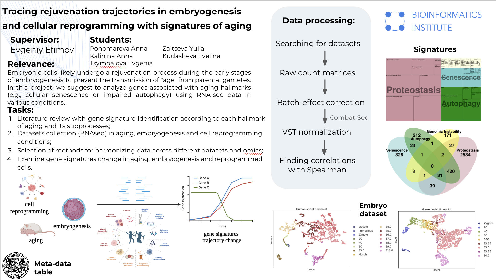
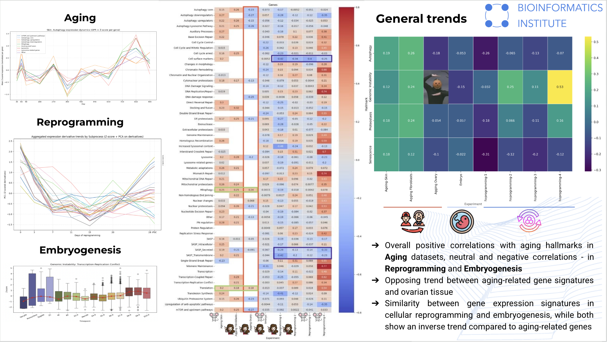

# Rejuvenating-Embryos

Embryonic cells likely undergo a rejuvenation process during the early stages of embryogenesis to prevent the transmission of "age" from parental gametes. In this project, we suggest analyzing genes associated with aging hallmarks (e.g., cellular senescence or impaired autophagy) using RNA-seq data in various conditions. The goal of our work was to attempt to identify putative subprocesses age is reset.

We expected to observe trends with the opposite behaviour in the Aging-Embryogenesis or Aging-Reprogramming comparisons for some of the subprocesses in ageing hallmarks. Genes involved in these subprocesses could likely be responsible for the cellular age “reset” in early embryogenesis.

## Embryogenesis

For embryogenesis we needed to have data about as many time points as possible. We selected a reference study https://www.nature.com/articles/s41592-024-02511-3 where authors have already collected a lot of RNA-seq embryonic datasets, then merged them and corrected the butch-effect. As a result, they created a scanpy-readable h5ad object. This source contains data about both mouse and human. In this way, these single-cell datasets (both mouse and human) were selected for embryogenesis trajectories building.

## Reprogramming

A list of reprogramming datasets was compiled, four of which were selected for further analysis. For each dataset, raw count matrices were obtained if not publicly accessible, metadata were assembled, a variance‐stabilizing transformation (VST) was applied, and Spearman’s correlation coefficients were computed for each gene and hallmark. The code implementing these transformations is provided in the Trajectories/Reprogramming folder.

## Aging

To integrate multiple bulk RNA-seq datasets related to aging in Mus musculus, we merged raw count data and applied ComBat-seq, from sva R-package to correct for batch effects. We then used DESeq2 R-package with a design formula including Day and Tissue to account for variation due to those factors, using these counts later in a likelihood ratio test (LRT) to identify time-dependent genes. We also applied variance stabilizing transformation (VST) from DESeq2 to the ComBat-seq-corrected counts, and used the resulting data throughout the rest of the analysis - including expression trajectory plotting and co-expression module detection. For aging in Homo Sapiens, we needed data for the different ages. We chose the Tabula Sapiens dataset (https://figshare.com/articles/dataset/Tabula_Sapiens_v2/27921984) because it contains early ages of different cell types from 11 male and 13 female donors. They  balance and assign cell types from each tissue compartment and optimally mix high-quality plate-seq data and high-volume droplet-based data to provide a broad and deep benchmark atlas. As a result, they created a scanpy-readable object called h5ad.

## Data analysis

Spearman correlation analysis was chosen because it allows estimation of the monotonic relationship between two variables without requiring a linear relationship. We calculated the Spearman correlation coefficient between the expression level of individual genes or groups of genes and age.
To identify the most significant age-related changes in gene expression, we selected only those trajectories for which the Spearman correlation coefficient modulus exceeded 0.2.
To correctly compare aging trajectories with embryogenesis and reprogramming processes, we used two different single-cell RNA-seq datasets. To compare aging trends with embryogenesis, a dataset of ovarian cell sequencing in women of different ages (from 26 to 56 years) was used.
And for comparison with the reprogramming process, we used a single-cell dataset obtained from skin samples. From this dataset, we selected data related to fibroblasts, since reprogramming was carried out precisely on these cells. The time period in this dataset covered the age from 33 to 61 years.

## Results

Extended description of the results you can find in the thesis document.
